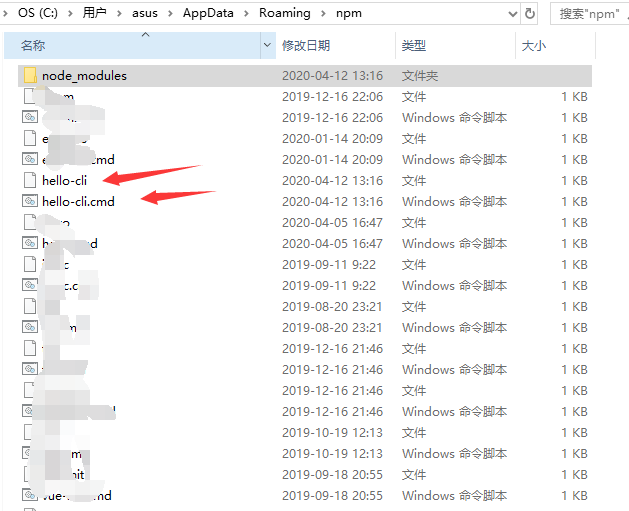
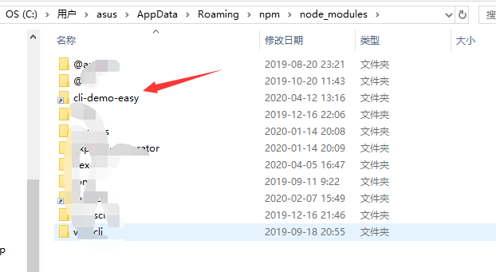

# node  
node的重要性，我想不用我多说，总之就一句话，如果不是node的出现，  
前端这个概念都不一定会被人知道,我个人比较喜欢从做中学习，那么今天就先做一个  
类似于Vue-cli的简易版的cli=>cli-demo-easy.js  
首先，我们分析一下需求  
1. 指令能在命令行中实现，并根据命令创建不同的工程名  
2. 执行指令后，要在目录下创建一个工程模板，模板中要包括html文件,css,js以及images文件夹  
3. 方便大家后面的重复使用  
然后，我们开始对需求进行拆分  
* 需求一  
1. 前端er现在基本都有node，而node是可以直接在命令行中进行操作，这个不需要担心  
2. 既然是创建文件，无论是文件的读取亦或是写入都要引入fs模块  
```js  
const fs = require('fs');  
```  
* 需求二  
1. 既然是执行指令，那么就意味着我们必须要先拿到指令才行  
```js  
// 获取用户要生成的项目名称，process.argv[2]  
/**  
*   process 对象是一个全局变量，它提供有关当前 Node.js 进程的信息并对其进行控制。  
*   作为一个全局变量，它始终可供 Node.js 应用程序使用，无需使用 require()  
*   process.argv 属性返回一个数组，其中包含当启动 Node.js 进程时传入的命令行参数。  
*   第一个元素是 process.execPath，也就是node.exe所在的路径。 第二个元素将是正在执行的 JavaScript 文件的路径。  
*   其余元素将是任何其他命令行参数。如本次执行命令为node cli-demo app，那么app就是我们的第三个参数，也就是项目名，通过process.argv[2]获取  
*/  
let appName = process.argv[2]||'app';  
// 根据项目名称生成指定的目录  
let appRoot = __dirname + '/' + appName;  
```  
2. 开始创建模板  
```js  
// 开始生成文件  
fs.mkdirSync( appRoot );  
fs.mkdirSync( appRoot + '/images' );  
fs.mkdirSync( appRoot + '/css' );  
fs.mkdirSync( appRoot + '/js' );  

fs.writeFileSync(appRoot + '/index.html', `  
<!DOCTYPE html>  
<html lang="en">  
<head>  
    <meta charset="UTF-8">  
    <meta name="viewport" content="width=device-width, initial-scale=1.0">  
    <meta http-equiv="X-UA-Compatible" content="ie=edge">  
    <title>App</title>  
</head>  
<body>  
    <h1>App</h1>  
</body>  
</html>  
    `);  
```  
这个时候我们就可以在命令行中  
```js  
node cli-demo-easy app  
```  
来创建一个app应用了  
* 需求三  
1. 既然是后面都可以用，那也就意味着在全局中使用  
    如果是全局中使用，那么我们就必须要通过npm了  
    首先，在命令行中执行  
```js  
npm init -y  
```  
然后我们就可以得到一个package.json文件  
文件内容如下  
```js  
{  
  "name": "cli-demo-easy",  
  "version": "1.0.0",  
  "description": "",  
  "main": "index.js",  
  "scripts": {  
    "test": "echo \"Error: no test specified\" && exit 1"  
  },  
  "keywords": [],  
  "author": "",  
  "license": "ISC"  
}  
```  
接下来我们通过npm run scripts来实现,将cli-demo-easy的内容都复制到index中，然后在scripts下加一段就可以了  
```js  
  "scripts": {  
    "test": "echo \"Error: no test specified\" && exit 1",  
    "cli-e": "node index.js"  
  },  
```  
这时我们便可以在命令行中使用  
```js  
npm run cli-e app  
```  
来实现和node cli-demo-easy app同样的效果，  
接下来就是全局使用的重点操作了  
1. index.js文件顶部声明执行环境  
```js  
#!/usr/bin/env node  
```  
添加#!/usr/bin/env node或者#!/usr/bin/node，这是告诉系统，下面这个脚本，使用nodejs来执行。  
2. 添加package.json的bin字段。  
具体如下  
```js  
"main": "index.js",  
  "bin": {  
    "hello-cli": "index.js"  
  },  
```  
bin字段里面写上这个命令行的名字，也就是hello-cli，它告诉npm，里面的js脚本可以通过命令行的方式执行，以hello-cli的命令调用。  
3. 在index.js所在的文件夹下执行  
```js  
npm link  
```  
将当前的代码在npm全局目录下留个快捷方式。  
  
npm检测到package.json里面存在一个bin字段，它就同时在全局npm包目录下生成了一个可执行文件  
当我们在系统命令行直接执行hello-cli的时候，实际上就是执行这里的脚本。  
  
这样，第一个cli脚本就成功安装了，可以在命令行里面，直接敲hello-cli,就可以看到结果了  
当然了，这样做还有一个问题，那就是不论我们在哪里新建项目，这个项目始终都是在我们写的这个index.js同目录下生成的  
我们需要做个改动，将__dirname修改为process.cwd()，然后大功告成  

[详细代码]()  

参考链接：  
[node官网](nodejs.cn/api/process.html)  
[手把手教你写一个 Node.js CLI](https://www.jianshu.com/p/1c5d086c68fa)  
[手把手教你使用nodejs编写cli(命令行)](https://www.jianshu.com/p/095c968d406f)  

