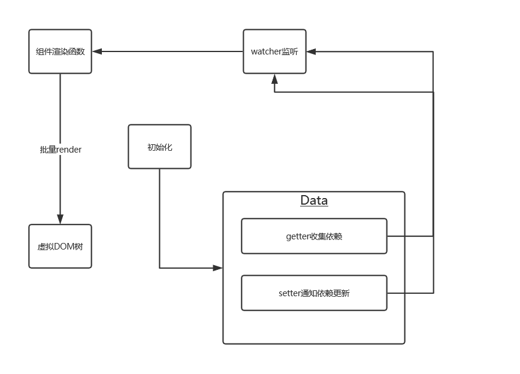

# vue  

## 目录  
* [响应式原理的实现](#响应式原理的实现)  


### 响应式原理的实现  
在说响应式原理之前，首先要说一下响应式的由来  
当页面上的一个数据的变化会引起其他一部分数据的变化，用代码表示  
```js  
var x,y  
var f = (n)=>{n++}  
x = 1  
y = f(x)  
console.log(y)  
x = 2  
y = f(x)  
console.log(y)  
```  
在前端逻辑不复杂的时候，这么处理是勉强可以接受的，但是随着前端的发展，  
前端越来越复杂，那么上面那种处理方式就会使代码十分的臃肿，并且使逻辑变得混乱  
于是，在这种情形下，响应式便应运而生了  
```js  
var x,y  
var f = (n)=>{console.log(n++)}  
var OnXChange = function(){}  
// 我们需要去定义OnXChange函数，使其能够实现当x改变的时候，y也会随之改变  
// 而不是通过代码去一步步的调用  
OnXChange(()=>{  
    y=f(x)  
    console.log(y)  
})  
x=1  
x=2  
```  
如果要实现上面的效果，我们就需要用到Object.defineProperty这个方法  
而这个方法又不能作用在引用类型上，那么我们需要对输入值x进行一个改造  
```js  
var ref = (initValue)=>{  
    let value = initValue  
    return Object.defineProperty({},'value',{  
        get(){  
            return value  
        }  
        set(newValue){  
            value = newValue  
        }  
    })  
}  
// 然后输入初始值  
x = ref(1)  
// 既然x已经被转为引用类型了，那么后面的调用的方式也要随之改变  
OnXChange(()=>{  
    y=f(x.value)  
    console.log(y)  
})  
x.value = 2  
x.value = 3  
```  
当然了，我们还需要在set函数中调用一下才能走通这一步  
完整代码如下  
```js  
var x,y  
var f = (n)=>{console.log(n++)}  

var active  
var OnXChange = function(func){  
    active= func  
    // 如果要使数据在第一次定义的时候就出发该函数，那么就需要在此函数中调用一次  
    active()  
    active=null  
}  

var ref = (initValue)=>{  
    let value = initValue  
    return Object.defineProperty({},'value',{  
        get(){  
            return value  
        },  
        set(newValue){  
            value = newValue  
            active()  
        }  
    })  
}  
x = ref(1)  
OnXChange(()=>{  
    y=f(x.value)  
    console.log(y)  
})  
x.value = 2  
x.value = 3    
```  
这个时候我们已经初步实现了一个响应式，但是在实际生产中不可能说每次都是输入的x值，也有可能是z，k或是其他值，  
那么我们就需要对上面那个流程进行一个扩展，在此基础上增加一个依赖收集  
```js  
class DepCollection{  
    deps = new Set()  
    depend(){  
        if(active)){  
            this.deps.add(active)  
        }  
    }  
    notify(){  
        this.deps.forEach(dep=>dep())  
    }  
}  
// 然后去修改一下ref函数，使其能够完整实现监听功能  
var ref = (initValue)=>{  
    var value = initValue  
    var deps=new DepCollection()  
    return Object.defineProperty({},'value',{   
        get(){  
            deps.depend()  
            return value  
        },  
        set(newValue){  
            value = newValue  
            deps.notify()  
        }  
    })  
}  

```  
那么完整代码如下  
```js  
let x;  
let y;  
let f = n => n++;  

let active;  

let onXChanged = function(cb) {  
  active = cb;  
  active();  
  active = null;  
};  

class DepCollection {  
  constructor() {  
    this.deps = new Set();  
  }  
  depend() {  
    if (active) {  
      this.deps.add(active);  
    }  
  }  
  notify() {  
    this.deps.forEach(dep => dep());  
  }  
}  

let ref = initValue => {  
  let value = initValue;  
  let dep = new DepCollection();  

  return Object.defineProperty({}, "value", {  
    get() {  
      dep.depend();  
      return value;  
    },  
    set(newValue) {  
      value = newValue;  
      dep.notify();  
    }  
  });  
};  

x = ref(1); // 2  

onXChanged(() => {  
  y=f(x.value)  
  console.log(y)  
});  

x.value = 2; // 3  
x.value = 3; // 4  
```  
vue的响应式原理的流程如下：  
  
其中DepCollection类的作用就相当于watcher，负责监听数据，每当数据产生时，通过depend数据收集，通过notify触发更新  
而ref就相当于Data数据处理部分，将输入的数据改造成可以被监听的数据，通过getter将数据传给watcher进行依赖收集，通过setter触发watcher的notify函数  
然后由notify函数触发渲染函数，最终实现了一个完整的响应式  
上面是vue2所使用的方法，借助Object.defineProperty去实现响应式，而vue3则是采用了proxy,如果要进行更改，则只需要对Object.defineProperty部分更改即可
```js
let ref = initValue => {  
  let value = initValue;  
  let dep = new DepCollection();  

//   return Object.defineProperty({}, "value", {  
//     get() {  
//       dep.depend();  
//       return value;  
//     },  
//     set(newValue) {  
//       value = newValue;  
//       dep.notify();  
//     }  
//   });  
    return new Proxy({value:initValue}, {
        get(target, key, value) {
          dep.depend();  
          return target[key];  
        },
      
        set(target, key, value) {
          target[key]=value;  
          dep.notify();
        }
      })
};
```