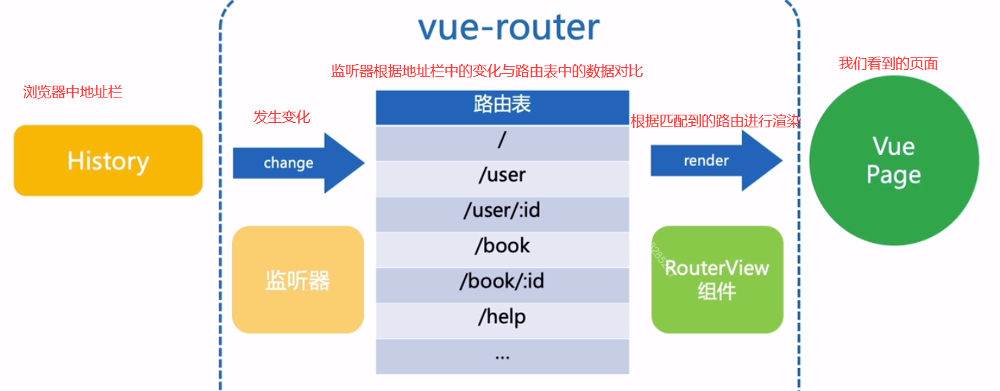

# vue-router 的源码分析

## 路由原理
### HTML5 Mode
### hash Mode

浏览器有两个监听浏览器地址发生变化的事件
+ onhashchange  监听URL中#后面的变化
```js
window.onhashchange = function(){
    console.log(location.hash)
}
// 通过location.hash=“/anotherhash”去修改
```
+ onpopstate  触发时机


1. 点击浏览器前进，后退按钮
2. history.back()
3. history.forward()
4. history.go()
```js
window.addEventListener = ("onpopstate",()=>{
     console.log(window.location.pathname)
})
// 修改方式
history.pushState({},"title","anotherpage.html")
history.replaceState({},"title","anotherpage.html")
// 需要注意的是这两个事件不会触发onpopstate事件
```
## HTML5 Mode

第一步
简单实现路由切换时，页面随之切换
我们需要实现路由监听，路由表，渲染页面三部分
路由监听，通过onhashchange或者onpopstate实现
路由表


