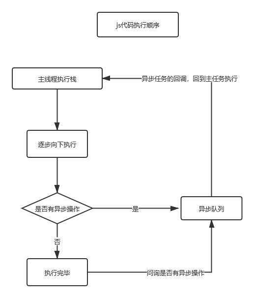
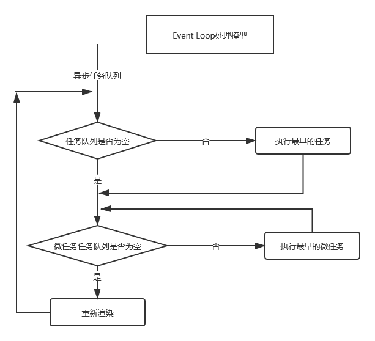

# js执行顺序与浏览器Event Loop  
了解js的执行顺序有利于我们对于回调的认知，避免因执行顺序而引起的bug  

我们都知道js是单线程执行的，借助浏览器的多线程从而实现回调  
浏览器所使用的技术就是Event Loop，首先看一段代码  
```js  
console.log("1");  
setTimeout(function() {  
  console.log("2");  
}, 0);  
Promise.resolve().then(function() {  
  console.log("3");  
});  
console.log("4");  

console.log("start");  

setTimeout(() => {  
  console.log("setTimeout");  
  new Promise(resolve => {  
    console.log("promise inner1");  
    resolve();  
  }).then(() => {  
    console.log("promise then1");  
  });  
}, 0);  

new Promise(resolve => {  
  console.log("promise inner2");  
  resolve();  
}).then(() => {  
  console.log("promise then2");  
});  
```  
  

在浏览器中打印出结果，我们发现即使大家都是回调，执行的顺序也有不同  
这是因为浏览器中还有宏任务和微任务之分  
**只有微任务执行完之后，宏任务才会被执行**  
一般常见的任务如下：  
微任务：  
*   promise  
*   process.nextTick  
*   postMessage  
*   object.observe  

宏任务：  
*   script  
*   定时器/settimeOut||setInterval  
*   UIrendering  
在刚刚的代码执行过程中，我们发现  
  