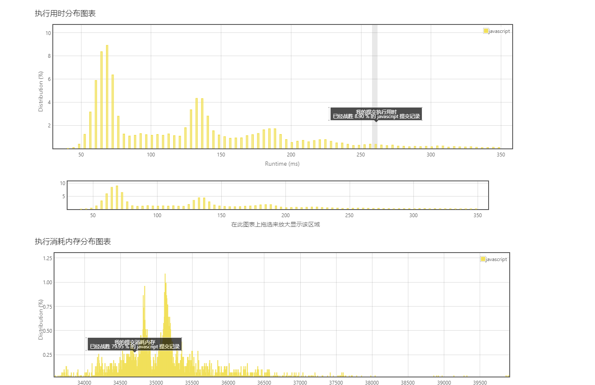
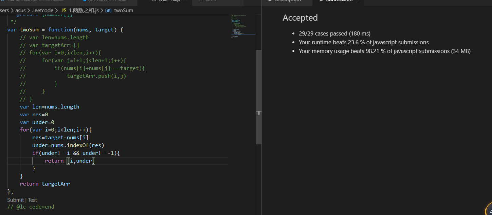

# 算法部分

第一次提交，先选了个最简单的  两数之和

给定一个整数数组 nums 和一个目标值 target，请你在该数组中找出和为目标值的那 两个 整数，并返回他们的数组下标。
你可以假设每种输入只会对应一个答案。但是，你不能重复利用这个数组中同样的元素。
示例:
```js
给定 nums = [2, 7, 11, 15], target = 9

因为 nums[0] + nums[1] = 2 + 7 = 9
所以返回 [0, 1]
```
```js
var twoSum = function(nums, target) {
    // 注释部分为第一次提交
    // var len=nums.length
    // var targetArr=[]
    // for(var i=0;i<len;i++){
    //     for(var j=i+1;j<len+1;j++){
    //         if(nums[i]+nums[j]===target){
    //             targetArr.push(i,j)
    //         }
    //     }
    // }
    var len=nums.length
    var res=0
    var under=0
    for(var i=0;i<len;i++){
        res=target-nums[i]
        under=nums.indexOf(res)
        if(under!==i && under!==-1){
            return [i,under]
        }
    }
    return targetArr
};
```
第一次提交结果如下

后来优化之后



